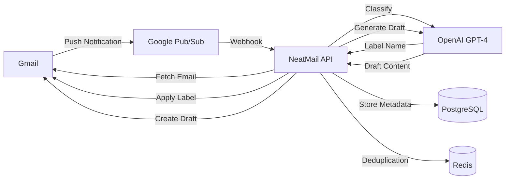

<div align="center">
  <h1>NeatMail</h1>
  <p><strong>Your Inbox Deserves Better</strong></p>
  <p>AI-powered email automation that labels your Gmail messages automatically and drafts intelligent responses.</p>
  
  <p>
    <a href="https://www.neatmail.tech">Website</a> •
    <a href="#features">Features</a> •
    <a href="#getting-started">Getting Started</a> •
    <a href="#deployment">Deployment</a> •
    <a href="#tech-stack">Tech Stack</a>
  </p>

  
  
  
  
</div>

---

## 🎯 What is NeatMail?

NeatMail is an intelligent email management platform that automatically organizes your Gmail inbox in real-time. No complicated setup, no manual sorting - just clean, organized emails labeled exactly where you need them in Gmail.

### The Problem
- Drowning in emails with no structure
- Spending hours manually organizing messages
- Missing important emails buried in clutter
- Wasting time drafting repetitive responses

### The Solution
NeatMail watches your inbox 24/7 and:
- ✨ **Automatically labels** incoming emails directly in Gmail
- 🎨 **Custom categories** - use presets or create your own
- 🤖 **AI-powered drafts** - generates response drafts for pending emails in your tone
- 🔄 **Real-time processing** - labels emails as they arrive, not in batches

---

## ✨ Features

### 🏷️ Smart Email Labeling
- **Preset Categories**: Action Needed, Pending Response, Automated Alerts, Event Updates, Discussion, Read Only, Resolved, Marketing
- **Custom Labels**: Create personalized labels with custom colors
- **Direct Gmail Integration**: Labels appear instantly in your Gmail interface
- **95%+ Confidence Threshold**: Only labels when AI is highly confident

### 🤖 AI Draft Responses
- Automatically detects emails requiring responses
- Generates contextual draft replies in your tone
- Creates drafts directly in Gmail for easy editing and sending
- Skips automated/newsletter emails intelligently

### 📊 Analytics Dashboard
- Weekly email trends visualization
- Real-time tracking of labeled emails
- Sender, subject, and label insights
- Date-based filtering and search

### 🔐 Security & Privacy
- OAuth 2.0 authentication via Clerk
- Minimal permission scope (read metadata, labels, drafts)
- No email content storage
- Row-level security with Prisma

---

## 🚀 Getting Started

### Prerequisites
- Node.js 20+ and npm/yarn/pnpm
- PostgreSQL database
- Redis instance
- Google Cloud Project with Gmail API enabled
- Clerk account for authentication
- OpenAI API key
- DodoPay account (payment processing)

### Installation

1. **Clone the repository**
```bash
git clone https://github.com/Lakshay1509/NeatMail.git
cd neatmail
```

2. **Install dependencies**
```bash
bun install
#or
npm install
# or
pnpm install
```

3. **Set up environment variables**

Create a `.env.local` file:

```env
# Database
DATABASE_URL="postgresql://..."
DIRECT_URL="postgresql://..."

# Clerk Authentication
NEXT_PUBLIC_CLERK_PUBLISHABLE_KEY=
CLERK_SECRET_KEY=
NEXT_PUBLIC_CLERK_SIGN_IN_URL=/sign-in
NEXT_PUBLIC_CLERK_SIGN_UP_URL=/sign-up
CLERK_WEBHOOK_SECRET=

# OpenAI
OPENAI_API_KEY=

# Gmail Webhook
GMAIL_WEBHOOK_TOPIC=projects/your-project/topics/gmail-notifications

#Gmail service account
GMAIL_SERVICE_ACCOUNT=

# Redis
UPSTASH_REDIS_URL=
UPSTASH_REDIS_TOKEN=

# Payment (DodoPay)
DODO_API=
DODO_WEBHOOK_SECRET=
DODO_PRODUCT_ID=
DODO_WEB_URL=
NEXT_PUBLIC_APP_URL=http://localhost:3000

# App Configuration
NODE_ENV=development
```

4. **Set up the database**
```bash
bunx prisma generate
bunx prisma db push
```


5. **Run the development server**
```bash
bun run dev
```

Open [http://localhost:3000](http://localhost:3000) in your browser.

---

## 🏗️ Architecture

### System Flow



### Key Components

- **Next.js 16** - Frontend & API routes
- **Hono** - Lightweight API framework
- **Prisma** - Type-safe ORM
- **Gmail API** - Email operations
- **OpenAI GPT-4** - Email classification & draft generation
- **Clerk** - Authentication & OAuth management
- **Redis** - Message deduplication
- **Google Pub/Sub** - Real-time webhook delivery

---

## 📦 Tech Stack

### Frontend
- **Framework**: Next.js 16.1.1 (App Router)
- **Language**: TypeScript 5.x
- **UI Library**: React 19.2.3
- **Styling**: Tailwind CSS 4.x
- **UI Components**: Radix UI, shadcn/ui
- **Charts**: Recharts 3.6.0
- **State Management**: TanStack Query 5.90.16 (React Query)
- **Forms**: React Hook Form 7.71.1 + Zod 4.3.5

### Backend
- **API**: Hono.js 4.11.3
- **Database**: PostgreSQL
- **ORM**: Prisma 7.2.0 with Prisma Adapter PG
- **Cache**: Redis (Upstash Redis 1.36.0)
- **Authentication**: Clerk 6.36.5
- **Payments**: DodoPay 2.14.1
- **Webhooks**: Svix 1.84.1

### AI & Integrations
- **Email Classification**: OpenAI 6.15.0 (GPT-4 Mini)
- **Draft Generation**: OpenAI 6.15.0 (GPT-4 Mini)
- **Email API**: Google APIs 169.0.0 (Gmail API)
- **Webhooks**: Google Cloud Pub/Sub

### Infrastructure
- **Hosting**: Vercel (recommended)
- **Database**: Neon/Supabase PostgreSQL
- **Redis**: Upstash Redis
- **Monitoring**: Vercel Analytics

---

## 🌐 Deployment

### Deploy to Vercel

[](https://vercel.com/new/clone?repository-url=https://github.com/yourusername/neatmail)

1. Click the button above or manually:
```bash
npm install -g vercel
vercel
```

2. Configure environment variables in Vercel dashboard

3. Set up Google Cloud Pub/Sub webhook:
   - Create a Pub/Sub topic
   - Add your Vercel domain as webhook endpoint
   - Grant Gmail API permissions

### Database Migration
```bash
npx prisma migrate deploy
```

---

## 🔧 Configuration

### Gmail API Setup

1. Go to [Google Cloud Console](https://console.cloud.google.com)
2. Create a new project
3. Enable Gmail API
4. Create OAuth 2.0 credentials
5. Add authorized redirect URIs (Clerk callback)
6. Create a Pub/Sub topic for webhooks

### Clerk Setup

1. Create a Clerk application
2. Enable Google OAuth provider
3. Add required Gmail scopes:
   - `https://www.googleapis.com/auth/gmail.modify`
   - `https://www.googleapis.com/auth/gmail.compose`
   - `https://www.googleapis.com/auth/gmail.readonly`
4. Configure webhook endpoints if needed

### Payment Setup (DodoPay)

1. Create a DodoPay account
2. Create a subscription product
3. Configure webhook endpoints for subscription events
4. Add webhook secret to environment variables

---

### Docker Support

1. **Configure Environment**
   Fill in the `.env.build` file with your credentials (ensure no empty lines or comments):
   ```env
   NEXT_PUBLIC_CLERK_PUBLISHABLE_KEY=...
   NEXT_PUBLIC_CLERK_SIGN_IN_URL=/sign-in
   NEXT_PUBLIC_CLERK_SIGN_UP_URL=/sign-up
   NEXT_PUBLIC_API_URL=http://localhost:8080
   DATABASE_URL=...
   DIRECT_URL=...
   UPSTASH_REDIS_URL=...
   UPSTASH_REDIS_TOKEN=...
   OPENAI_API_KEY=...
   ```

2. **Build Image**
   Build the container image using `podman` (or docker), passing the variables as build arguments:
   ```bash
   podman build \
     $(sed 's/^/--build-arg /' .env.build) \
     -t neatmail .
   ```

3. **Run Container**
   Run the container passing the environment variables:
   ```bash
   podman run -p 8080:8080 --env-file .env.build neatmail

<!-- ## 📂 Project Structure

```


``` -->

### Key Directories

- **`/app`** - Next.js 16 App Router with route groups for auth and dashboard
- **`/components`** - Reusable React components including shadcn/ui primitives
- **`/features`** - Custom React Query hooks organized by feature domain
- **`/lib`** - Core utilities for Gmail, OpenAI, Prisma, Redis integrations
- **`/prisma`** - Database schema with multi-schema support and generated client
- **`/types`** - Shared TypeScript interfaces and type definitions

---

## 🤝 Contributing

We love contributions! Here's how you can help:

1. **Fork the repository**
2. **Create a feature branch** (`git checkout -b feature/amazing-feature`)
3. **Commit changes** (`git commit -m 'Add amazing feature'`)
4. **Push to branch** (`git push origin feature/amazing-feature`)
5. **Open a Pull Request**

### Development Guidelines
- Follow TypeScript best practices
- Write meaningful commit messages
- Add tests for new features
- Update documentation as needed
- Ensure code passes linting (`npm run lint`)

---

## 📝 License

This project is licensed under the MIT License - see the [LICENSE](LICENSE) file for details.

---

## 🙏 Acknowledgments

- [Next.js](https://nextjs.org/) - React framework
- [Clerk](https://clerk.com/) - Authentication
- [OpenAI](https://openai.com/) - AI models
- [Prisma](https://www.prisma.io/) - Database ORM
- [shadcn/ui](https://ui.shadcn.com/) - UI components

---

## 📧 Support

- **Website**: [neatmail.tech](https://www.neatmail.tech)
- **Issues**: [GitHub Issues](https://github.com/Lakshay1509/NeatMail/issues)
- **Email**:  help.neatmail@gmail.com

---

<div align="center">
  <p>Built with ❤️ by the NeatMail team</p>
</div>
