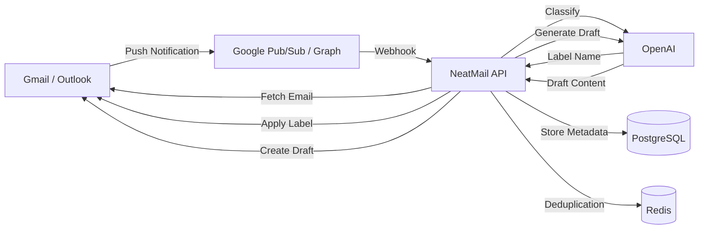

<div align="center">
  <h1>NeatMail</h1>
  <p><strong>Your Inbox Deserves Better</strong></p>
  <p>AI-powered email automation that labels your Gmail and Outlook messages automatically and drafts intelligent responses.</p>
  
  <p>
    <a href="https://www.neatmail.tech">Website</a> •
    <a href="#features">Features</a> •
    <a href="#getting-started">Getting Started</a> •
    <a href="#deployment">Deployment</a> •
    <a href="#tech-stack">Tech Stack</a>
  </p>

  <p>
    
    
    
    
  </p>
</div>

---

## 📖 Table of Contents

- [What is NeatMail?](#-what-is-neatmail)
- [Features](#-features)
- [Getting Started](#-getting-started)
  - [Prerequisites](#prerequisites)
  - [Installation](#installation)
- [Architecture](#-architecture)
- [Tech Stack](#-tech-stack)
- [Configuration](#-configuration)
- [Deployment](#-deployment)
- [Contributing](#-contributing)
- [License](#-license)

---

## 🎯 What is NeatMail?

NeatMail is an intelligent email management platform that automatically organizes your Gmail and Outlook inboxes in real-time. No complicated setup, no manual sorting—just clean, organized emails labeled exactly where you need them.

### The Problem
- Drowning in emails with no structure
- Spending hours manually organizing messages
- Missing important emails buried in clutter
- Wasting time drafting repetitive responses

### The Solution
NeatMail watches your inbox 24/7 and:
- ✨ **Automatically labels** incoming emails directly in Gmail and Outlook
- 🎨 **Custom categories** - use presets or create your own
- 🤖 **AI-powered drafts** - generates response drafts for pending emails in your tone
- 🔄 **Real-time processing** - labels emails as they arrive, not in batches

---

## ✨ Features

- **🏷️ Smart Email Labeling**: Automatically categorizes emails with a 95%+ confidence threshold.
- **🤖 AI Draft Responses**: Contextual draft replies generated in your tone.
- **📊 Analytics Dashboard**: Weekly email trends visualization and insights.
- **🔐 Security & Privacy**: Minimal permission scope, no email content storage, row-level security.

---

## 🚀 Getting Started

### Prerequisites
- Node.js 20+ and npm/yarn/pnpm/bun
- PostgreSQL database
- Redis instance (e.g., Upstash)
- Application credentials (Google Cloud, Microsoft Entra, Clerk, OpenAI)

### Installation

1. **Clone the repository**
   ```bash
   git clone https://github.com/Lakshay1509/NeatMail.git
   cd neatmail
   ```

2. **Install dependencies**
   ```bash
   bun install
   ```

3. **Set up environment variables**
   Copy the example environment file and fill in your credentials:
   ```bash
   cp .env.example .env.local
   ```

4. **Set up the database**
   ```bash
   bunx prisma db push
   bunx prisma generate
   
   ```

5. **Run the development server**
   ```bash
   bun run dev
   ```
   Open [http://localhost:3000](http://localhost:3000) to view it in the browser.

---

## 🏗️ Architecture


```mermaid
graph LR
   A[Gmail / Outlook] -->|Push Notification| B[Google Pub/Sub / Graph]
   B -->|Webhook| C[NeatMail API]
   C -->|Fetch Email| A
   C -->|Classify| D[OpenAI]
   D -->|Label Name| C
   C -->|Apply Label| A
   C -->|Generate Draft| D
   D -->|Draft Content| C
   C -->|Create Draft| A
   C -->|Store Metadata| E[(PostgreSQL)]
   C -->|Deduplication| F[(Redis)]
```

---

## 📦 Tech Stack

- **Frontend**: Next.js 16.1.1, React 19, Tailwind CSS 4, shadcn/ui, TanStack Query
- **Backend**: Hono.js, Prisma, PostgreSQL, Redis (Upstash), Clerk, Inngest
- **AI**: OpenAI GPT-4 Mini
- **Integrations**: Google APIs, Microsoft Graph API, DodoPay, Svix

---

## 🔧 Configuration

Please refer to the code comments and our documentation for detailed setup instructions regarding Gmail API, Outlook API, and Clerk. Webhooks play a central role, so ensure your Google Cloud Pub/Sub and Clerk webhook endpoints are correctly configured.

---

## 🌐 Deployment

NeatMail is optimized for Vercel. 

[](https://vercel.com/new/clone?repository-url=https://github.com/Lakshay1509/NeatMail)

1. Deploy to Vercel and configure environment variables.
2. Run database migrations: `npx prisma migrate deploy`
3. Configure your webhooks (Pub/Sub, Clerk, DodoPay) to point to your new domain.

---

## 🤝 Contributing

We welcome contributions! 

1. Fork the Project
2. Create your Feature Branch (`git checkout -b feature/AmazingFeature`)
3. Commit your Changes (`git commit -m 'Add some AmazingFeature'`)
4. Push to the Branch (`git push origin feature/AmazingFeature`)
5. Open a Pull Request

---

## 📝 License

Distributed under the MIT License. See `LICENSE` for more information.

---

<div align="center">
  <p>Built with ❤️ by the NeatMail team</p>
  <p><a href="https://www.neatmail.tech">neatmail.tech</a></p>
</div>
