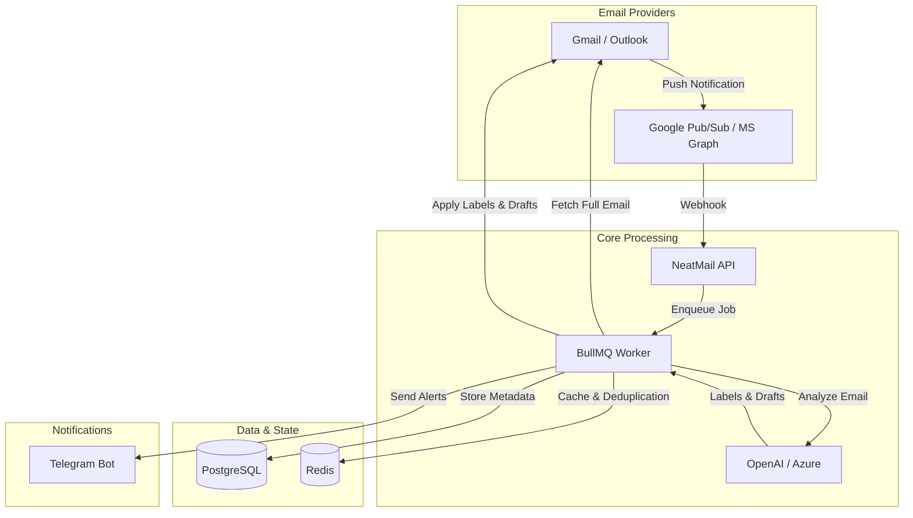

<div align="center">
  <h1>NeatMail</h1>
  <h2><strong>Get to inbox zero faster</strong></h2>
  <p>NeatMail organizes priority emails and drafts replies in Gmail and Outlook, so you can clear your inbox in less time.</p>
  
  <p>
    <a href="https://www.neatmail.app">Website</a> •
    <a href="#features">Features</a> •
    <a href="#getting-started">Getting Started</a> •
    <a href="#deployment">Deployment</a> •
    <a href="#tech-stack">Tech Stack</a>
  </p>

  <p>
    
    
    
    
  </p>

  
</div>

---

## Table of Contents

- [What is NeatMail?](#what-is-neatmail)
- [Features](#features)
- [Getting Started](#getting-started)
  - [Prerequisites](#prerequisites)
  - [Installation](#installation)
- [Architecture](#architecture)
- [Tech Stack](#tech-stack)
- [Configuration](#configuration)
- [Deployment](#deployment)
- [Contributing](#contributing)
- [License](#license)

---

## What is NeatMail?

NeatMail is an email management platform that automatically organizes your Gmail and Outlook inboxes in real-time. No complicated setup, no manual sorting — just clean, organized emails labeled exactly where you need them.

---

## Features

- **Gmail & Outlook Integration:** Connect in minutes via OAuth. Labels sync directly in real time.
- **Smart Email Labeling:** AI automatically categorizes incoming emails into labels like **Action Needed** or **Pending Response**.
- **Custom Labels:** Create personalized label systems to match your exact workflow.
- **AI-Powered Draft Replies:** Auto-generate context-aware draft responses based on your conversation history and writing tone.
- **One-Click Unsubscribe:** Instantly remove unwanted newsletters to keep your inbox clutter-free.
- **Auto-Archive Rules:** Set rules to automatically archive emails based on labels, senders, or categories.
- **Telegram Integration:** Receive alerts, set routing rules, and approve AI drafts directly from Telegram.

---

## Product Screenshots

<table align="center">
  <tr>
    <td align="center">
      
      <br />
      <b>Dashboard</b>
    </td>
    <td align="center">
      
      <br />
      <b>Smart Labels</b>
    </td>
  </tr>
  <tr>
    <td align="center">
      
      <br />
      <b>AI Drafts</b>
    </td>
    <td align="center">
      
      <br />
      <b>One-Click Unsubscribe</b>
    </td>
  </tr>
  <tr>
    <td align="center">
      
      <br />
      <b>One-Click Cleanup</b>
    </td>
    <td align="center">
      
      <br />
      <b>Follow-Ups</b>
    </td>
  </tr>
</table>

---

## Product Video

<a href="https://www.youtube.com/watch?v=_as6DVg6wvY" target="_blank">
  
</a>

---

## Getting Started

### Prerequisites
- Node.js 20+ and your preferred package manager (npm/yarn/pnpm/bun)
- PostgreSQL database
- Redis instance (e.g., Upstash)
- Third-party credentials for:
  - **Clerk** (Authentication)
  - **OpenAI** or **Azure OpenAI** (AI classification & drafts)
  - **Google Cloud Console** (Gmail API & Pub/Sub Webhooks)
  - **Microsoft Entra** (Outlook API & Webhooks)
  - **BullMQ** (Background jobs and queues — with Bull Board UI at `/api/bullboard`)
  - **DodoPay** (Payments)
  - **Resend** (Transactional emails)
  - **Telegram** (Bot token for chat integrations)

### Installation

1. Clone the repository
   ```bash
   git clone https://github.com/Lakshay1509/NeatMail.git
   cd neatmail
   ```

2. Install dependencies
   ```bash
   bun install
   ```

3. Set up environment variables
   ```bash
   cp .env.example .env.local
   ```

4. Set up the database
   ```bash
   bunx prisma db push
   bunx prisma generate
   ```

5. Run the development server
   ```bash
   bun run dev
   ```
   Open [http://localhost:3000](http://localhost:3000) in your browser.

---

## Architecture


```mermaid
graph TD
    subgraph Email Providers
        Inbox[Gmail / Outlook]
        PubSub[Google Pub/Sub / MS Graph]
    end

    Inbox -->|Push Notification| PubSub
    PubSub -->|Webhook| API[NeatMail API]

    subgraph Core Processing
        API -->|Enqueue Job| BullMQ[BullMQ Worker]
        BullMQ -->|Fetch Full Email| Inbox
        BullMQ -->|Analyze Email| AI[OpenAI / Azure]
        AI -->|Labels & Drafts| BullMQ
        BullMQ -->|Apply Labels & Drafts| Inbox
    end

    subgraph Data & State
        BullMQ -->|Store Metadata| DB[(PostgreSQL)]
        BullMQ -->|Cache & Deduplication| Redis[(Redis)]
    end

    subgraph Notifications
        BullMQ -->|Send Alerts| Telegram[Telegram Bot]
    end
```

---

## Tech Stack

- **Frontend**: Next.js 16.1.1, React 19, Tailwind CSS 4, shadcn/ui, TanStack Query
- **Backend**: Hono.js, Prisma, PostgreSQL, Redis (Upstash), Clerk, BullMQ
- **AI**: OpenAI GPT-4 Mini
- **Integrations**: Google APIs, Microsoft Graph API, DodoPay, Svix

---

## Configuration

Refer to the code comments and documentation for detailed setup instructions for the Gmail API, Outlook API, and Clerk. Webhooks are central to how NeatMail works — make sure your Google Cloud Pub/Sub and Clerk webhook endpoints are correctly configured before testing.

---

## Deployment

NeatMail is optimized for Vercel.

[](https://vercel.com/new/clone?repository-url=https://github.com/Lakshay1509/NeatMail)

1. Deploy to Vercel and configure environment variables.
2. Run database migrations: `npx prisma migrate deploy`
3. Point your webhooks (Pub/Sub, Clerk, DodoPay) to the new domain.

---

## Contributing

1. Fork the project
2. Create your feature branch (`git checkout -b feature/your-feature`)
3. Commit your changes (`git commit -m 'Add your feature'`)
4. Push to the branch (`git push origin feature/your-feature`)
5. Open a pull request

---

## License

Distributed under the Elastic License 2.0. See `LICENSE` for more information.

---

<div align="center">
  <p>Built by the NeatMail team — <a href="https://www.neatmail.app">neatmail.app</a></p>
</div>
