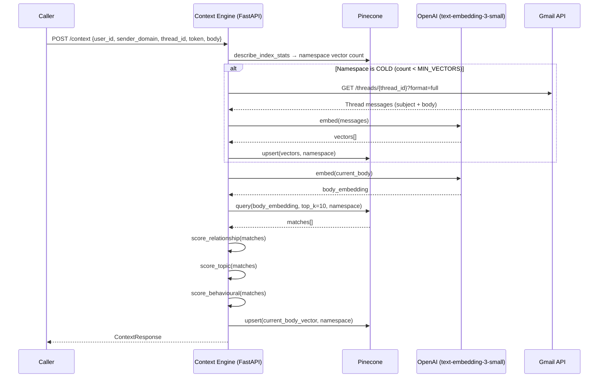

# NeatMail Context Engine — Reference

## Architecture flow



## Namespace strategy

| Segment | Value |
|---------|-------|
| Pinecone namespace | `"{user_id}::{sender_domain}"` |

Every user × sender gets its own isolated namespace — zero cross-contamination.

## Endpoint contract

### `POST /context`

**Request body**

```json
{
  "user_id":       "usr_abc123",
  "sender_domain": "github.com",
  "thread_id":     "18xxxxxxxxxxxxxx",
  "token":         "ya29.xxx",
  "body":          "Hey, your PR was merged…",
  "subject":       "PR #42 merged",
  "sender_email":  "noreply@github.com"
}
```

**Response**

```json
{
  "relationship_context": {
    "label": "relationship_context",
    "score": 0.7812,
    "description": "Moderate relationship – some prior engagement from this sender.",
    "top_matches": [...]
  },
  "topic_context": {
    "label": "topic_context",
    "score": 0.8543,
    "description": "High topic overlap – current email closely matches recurring themes.",
    "top_matches": [...]
  },
  "behavioural_context": {
    "label": "behavioural_context",
    "score": 0.6400,
    "description": "Dominant pattern: 'informational' (7/10 emails, avg similarity 0.80). Sender primarily sends informational updates.",
    "top_matches": [...]
  },
  "overall_relevance": 0.7963,
  "is_relevant": true,
  "vectors_upserted": 8,
  "namespace": "usr_abc123::github.com"
}
```

### `GET /health`
Returns `{ "status": "ok", "model": "text-embedding-3-small", "index": "neatmail-context" }`.

### `GET /namespace-stats?user_id=&sender_domain=`
Returns vector count for the given namespace.

## Overall relevance formula

```
overall = (relationship × 0.30) + (topic × 0.50) + (behavioural × 0.20)
is_relevant = overall >= RELEVANCE_THRESHOLD   # default 0.75
```

Topic is weighted heaviest because it most directly reflects whether the current
email fits established patterns from this sender.

## Context score semantics

| Context | Source signal | Tells you |
|---------|--------------|-----------|
| **Relationship** | cosine sim of **conversational-typed** matches | How much genuine back-and-forth the user has had with this sender |
| **Topic** | avg of top-3 cosine scores across all matches | Whether the email subject/body is topically familiar |
| **Behavioural** | dominant type ratio × avg score | Marketing / transactional / conversational / informational pattern |

## Environment variables

| Variable | Required | Default | Notes |
|----------|----------|---------|-------|
| `OPENAI_API_KEY` | ✅ | — | |
| `PINECONE_API_KEY` | ✅ | — | |
| `PINECONE_INDEX_NAME` | | `neatmail-context` | |
| `PINECONE_CLOUD` | | `aws` | |
| `PINECONE_REGION` | | `us-east-1` | |
| `MIN_VECTORS` | | `5` | Threshold for cold-start fetch |
| `TOP_K` | | `10` | Neighbours per query |
| `RELEVANCE_THRESHOLD` | | `0.75` | Cosine cutoff for `is_relevant` |
| `SERVICE_TOKEN` | | *(unset)* | If set, enforces `Authorization: Bearer <token>` |

## Running

```bash
pip install -r requirements.txt
cp .env.example .env   # fill in your keys

# dev
uvicorn main:app --reload --port 8000

# prod
uvicorn main:app --host 0.0.0.0 --port 8000 --workers 4
```

Interactive docs → [http://localhost:8000/docs](http://localhost:8000/docs)
